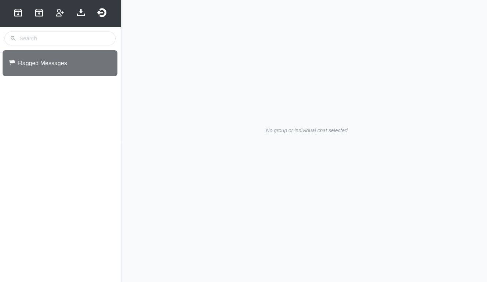

mPACT Administration
====================

## The user interface

The first time the superuser logs in, they will see an empty user
interface:



You can mouse over the icons in the top left to see what each one does.

A good place to start is to create a new chat group.


## Creating a new chat group

1. In Telegram, open the menu and choose "New Group".
1. Add the bot to the group. It will not appear as a contact. You will
   need to type its username (the same username as the BOT_USERNAME
   environment variable).
1. Give your new group a name.

The bot will be notified of its new group, and the group will be added
to the database. The next time you refresh the page or log into mPACT,
the group will appear in the left panel.


## Scheduling

Chats are associated with a set of `ScheduledMessage` objects, which
represent the schedule of messages to go out. All previous scheduled
messages are disabled when a new schedule is uploaded.

You can test scheduling in a development environment by running the
following commands. Get `<container_id>` from running `docker ps`.

```bash
docker cp /path/to/mpact_schedules.xlsx <container_id>:/mpact_schedules.xlsx
docker-compose exec web ./manage.py upload_schedule /mpact_schedules.xlsx 
```

The actual sending of messages is managed via
[`django-celery-beat`](https://django-celery-beat.readthedocs.io/en/latest/).

When schedules are uploaded, once-off `PeriodicTask` objects are created
for each row in the schedule. These will call `tasks.send_msgs` with the
appropriate arguments for the chat.


### Creating schedules

Click the "Download schedules" icon and save "schedules.xlsx". Then open
it in your spreadsheet application.

You will see that the sheet has three columns, "Days", "Message" and
"Comment".

"Days" is the interval, in days, from the creation of the chat group, at
which the message will be sent. e.g. A value of "1" means that the
message will be sent on the first day.

"Message" is the message that will be sent.

"Comment" is any information that you or other administrators might find
useful. This could be a translation of the message, if it is not in a
language you can read, or maybe context that would help explain the
message.

The sheet's tab is includes the name of the group, and its Telegram ID.
It is important not to change the Telegram ID, otherwise mPACT will be
unable to send the messages to the group.


When you are done, save the spreadsheet and upload it using the "Upload
schedules" icon.


### The admin interface

mPACT has a second interface, the admin interface, which gives
superusers direct access to data. Normal users are not given a link to
the admin interface. Superusers will need to navigate to it manually, by
changing their browser's URL to ".../admin/". For example, if you are
using the environment on Heroku, the URL will start with
"http://mpact-demo.herokuapp.com/chat". Change that to
"http://mpact-demo.herokuapp.com/admin/" and log in as the superuser.


Choose "Scheduled messages" under "MPACT".

There you will see a list of the messages you uploaded. By using the box
on the right, you can filter the list to show only the messages that are
enabled.

If you click on a message, it will show you its details. Here you can 
edit it, and disable or enable it.

If you disable a message, mPACT will not send it.

You can also use the admin interface to delete scheduled messages and
create new ones. If you download schedules from the normal interface
again, you will see that the changes you made in the admin interface are
present in the downloaded spreadsheet.
