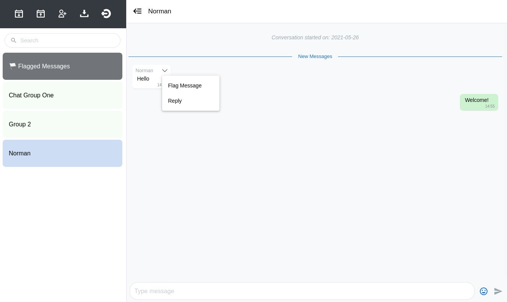

=============================
UW mPACT Administration Guide
=============================

The user interface
------------------

The first time the superuser logs in, they will see an empty user
interface:

.. image:: img/01_first_time_login.png
   :alt: Empty user interface

You can mouse over the icons in the top left to see what each one does.

A good place to start is to create a new chat group, which is handled by Telegram and not the mPACT application.

Creating a new chat group
-------------------------

#. In Telegram, open the menu and choose "New Group".
#. Add the bot to the group. It will not appear as a contact. You will
   need to type its username (the same username as the BOT_USERNAME
   environment variable).
#. Give your new group a name, and press the check mark to create the
   group.
#. Press the group name to see its members.
#. Long-press on the bot and select "Promote to Admin", otherwise the
   bot will be unable to see any messages from other members.

The bot will be notified of its new group, and the group will be added
to the database. The next time you refresh the page or log into mPACT,
the group will appear in the left panel.

Scheduling
----------

Group chats are associated with a set of `ScheduledMessage` objects,
which represent the schedule of messages to go out.

The actual sending of messages is managed via `django-celery-beat`_.

When schedules are uploaded, once-off `PeriodicTask` objects are created
for each row in the schedule. These will call `tasks.send_msgs` with the
appropriate arguments for the chat.

Creating schedules
^^^^^^^^^^^^^^^^^^

Click the "Download schedules" icon and save "schedules.xlsx". Then open
it in your spreadsheet application.

You will see that the sheet has three columns, "Days", "Message" and
"Comment".

"Days" is the interval, in days, from the creation of the chat group, at
which the message will be sent. e.g. A value of "1" means that the
message will be sent on the first day.

"Message" is the message that will be sent.

"Comment" is any information that you or other administrators might find
useful. This could be a translation of the message, if it is not in a
language you can read, or maybe context that would help explain the
message.

Each chat group has its own sheet. The sheet's tab includes the
name of the group and its Telegram ID.

It is important not to change the Telegram ID, otherwise mPACT will not
know which group the messages are for, and will be unable to send the
messages to the group.

In order for the spreadsheet to include the Telegram IDs of each chat
group, the group must first be created, and then the schedules
downloaded, for messages to be added.

.. image:: img/03_schedules.png
   :alt: Schedules

When you are done, save the spreadsheet and upload it using the "Upload
schedules" icon.

All previous scheduled messages are disabled when a new schedule is
uploaded.

The admin interface
^^^^^^^^^^^^^^^^^^^

mPACT has a second interface, the admin interface, which gives
superusers direct access to data. Normal users are not given a link to
the admin interface. Superusers will need to navigate to it manually, by
changing their browser's URL to ".../admin/". For example, if you are
using the environment on Heroku, the URL will start with
"http://mpact-demo.herokuapp.com/chat". Change that to
"http://mpact-demo.herokuapp.com/admin/" and log in as the superuser.

.. image:: img/04_admin_interface.png
   :alt: Admin interface

Choose "Scheduled messages" under "MPACT".

There you will see a list of the messages you uploaded. By using the box
on the right, you can filter the list to show only the messages that are
enabled.

If you click on a message, it will show you its details. Any changes
that you make will update messages that are scheduled to be sent.

If you download schedules from the normal interface, you will see that
any changes you made in the admin interface are present in the
downloaded spreadsheet.

Starting schedules
^^^^^^^^^^^^^^^^^^

Choose "Group chats", also under "MPACT", and click on a group chat to
edit it.

.. image:: img/09_schedule_start.png
   :alt: Starting schedules

At the bottom of the form are two fields: "Schedule start date" and
"Schedule start time". Their default values are the date and time when
the group chat was created, but you can change their values.

Change them to the date and time that marks the start of the schedule
of this group chat's scheduled messages. So a message that is scheduled
to be sent after two days will be sent two days after the moment given
here.

Use these fields to reset the schedule, or to change the time at which
they are sent.

User management
---------------

mPACT users are managed with the admin interface.

Choose "Users" under "Authentication and Authorization". You will see a
list of users, and at first, it will include only your user.

To add a new user, click "Add user". You will be prompted for their
username and password:

.. image:: img/07_add_user.png
   :alt: Add user

Click "Save", and then proceed to enter optional data about the user.

User permissions
^^^^^^^^^^^^^^^^

New users are marked "Active" by default. Users who are not active will
not be allowed to log in, but their accounts remain in the database, and
can be marked active again in the future.

Users with "staff status" are allowed to log into the admin interface.
You can set what data they can see, and what data they can modify using
the "user permissions" field below.

Users with "superuser" status can log into the admin interface and have
all user permissions.

User groups
^^^^^^^^^^^

If you have different kinds of staff users, user groups make it easier
to assign different sets of permissions to them.

Again under "Authentication and Authorization", choose "Groups".

Click "Add group" to create a new group. You can give it a name, and
assign permissions to it:

.. image:: img/08_add_group.png
   :alt: Add group

Now you can edit users and assign them to groups in order to grant them
those groups' permissions.

Individual chats
----------------

In order to engage with participants one-on-one, the participant must
first message the bot directly. In order to do that, they can ...

#. Press the bot's name to open their details
#. Press the "message" icon
#. Send a message

The interface will not show a separate chat for the participant
immediately. The next time you refresh the page or log into mPACT,
an individual chat with the participant will appear in the left panel.

After that, messages from participants will appear as they are sent.

Uploading study participants
----------------------------

You can add participants to the study in bulk.

mPACT expects a spreadsheet in Excel 2007-365 (.xlsx) format. It will
use the first worksheet. It looks for a column with the heading "Study
ID", and a column with the heading "Phone Number" (case sensitive). You
can use this `empty sample spreadsheet`_ as a start.

Click the "Upload Study Participants" icon. You will be prompted for the
spreadsheet.

mPACT does not store the phone numbers of participants. It uses the
Telegram API to look up their Telegram ID. It will do this for each
participant.

**NOTE:** The Telegram API will only return the Telegram ID of
participants that have messaged the bot in the past. (Telegram does not
allow bots to look up random people.) Thus, it is important to ask all participants
to directly message the bot if their data is to be linked to the relevant Study ID.
Participants must message the bot prior to the upload, but the upload can be done
more than once with no issues.

Flagging messages
-----------------

Flagging messages allows you to draw attention to specific messages for
follow-up or for important content. Click the down arrow to the right of
the participant's name, and choose "Flag message".

Flagged messages are listed under "Flagged Messages" in the panel on the
left.

.. note::
   Under "Flagged Messages", users will only see the messages that they
   themselves flagged; they will not see the messages flagged by other
   users.

In exported study data, messages flagged by any user are marked as
flagged.

Exporting study data
--------------------

Click the "Export" icon to download all messages. mPACT will generate a
CSV file that includes the senders' study participant ID (blank if
participant details have not been uploaded for that participant) 
and message details.

.. _django-celery-beat: https://django-celery-beat.readthedocs.io/en/latest/
.. _empty sample spreadsheet: https://github.com/dimagi/mpact/blob/main/docs/sample/study_participants.xlsx
