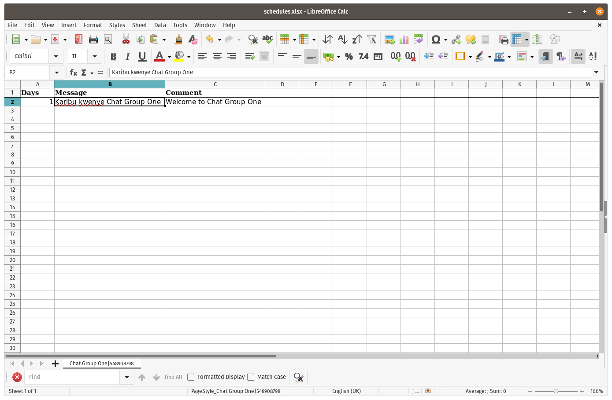
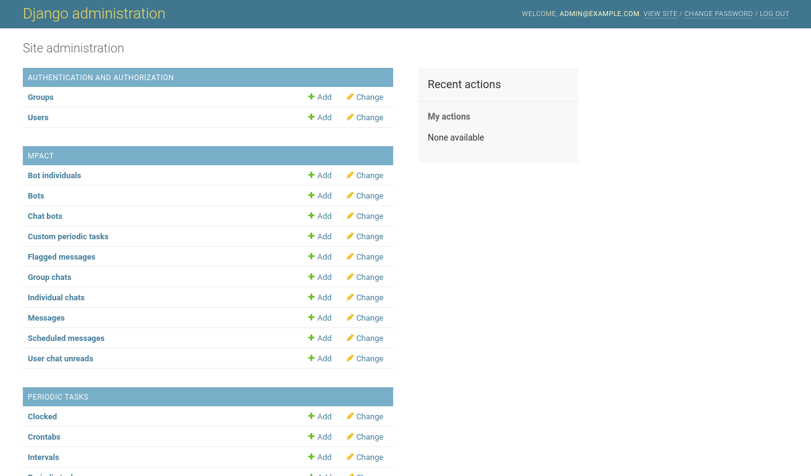
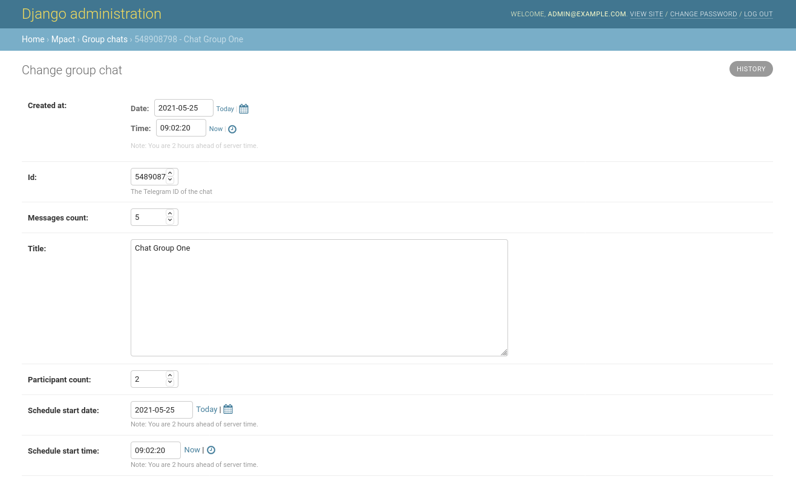

Scheduling
==========

Group chats are associated with a set of `ScheduledMessage` objects,
which represent the schedule of messages to go out.

The actual sending of messages is managed via `django-celery-beat`_.

When schedules are uploaded, once-off `PeriodicTask` objects are created
for each row in the schedule. These will call `tasks.send_msgs` with the
appropriate arguments for the chat.

Creating schedules
------------------

Click the "Download schedules" icon and save "schedules.xlsx". Then open
it in your spreadsheet application.

You will see that the sheet has three columns, "Days", "Message" and
"Comment".

"Days" is the interval, in days, from the creation of the chat group, at
which the message will be sent. e.g. A value of "1" means that the
message will be sent on the first day.

"Message" is the message that will be sent.

"Comment" is any information that you or other administrators might find
useful. This could be a translation of the message, if it is not in a
language you can read, or maybe context that would help explain the
message.

Each chat group has its own sheet. The sheet's tab includes the
name of the group and its Telegram ID.

It is important not to change the Telegram ID, otherwise mPACT will not
know which group the messages are for, and will be unable to send the
messages to the group.

In order for the spreadsheet to include the Telegram IDs of each chat
group, the group must first be created, and then the schedules
downloaded, for messages to be added.

When you are done, save the spreadsheet and upload it using the "Upload
schedules" icon.

All previous scheduled messages are disabled when a new schedule is
uploaded.

The admin interface
-------------------

mPACT has a second interface, the admin interface, which gives
superusers direct access to data. Normal users are not given a link to
the admin interface. Superusers will need to navigate to it manually, by
changing their browser's URL to ".../admin/". For example, if you are
using the environment on Heroku, the URL will start with
"http://mpact-demo.herokuapp.com/chat". Change that to
"http://mpact-demo.herokuapp.com/admin/" and log in as the superuser.

Choose "Scheduled messages" under "MPACT".

There you will see a list of the messages you uploaded. By using the box
on the right, you can filter the list to show only the messages that are
enabled.

If you click on a message, it will show you its details. Any changes
that you make will update messages that are scheduled to be sent.

If you download schedules from the normal interface, you will see that
any changes you made in the admin interface are present in the
downloaded spreadsheet.

Starting schedules
------------------

Choose "Group chats", also under "MPACT", and click on a group chat to
edit it.

At the bottom of the form are two fields: "Schedule start date" and
"Schedule start time". Their default values are the date and time when
the group chat was created, but you can change their values.

Change them to the date and time that marks the start of the schedule
of this group chat's scheduled messages. So a message that is scheduled
to be sent after two days will be sent two days after the moment given
here.

Use these fields to reset the schedule, or to change the time at which
they are sent.

.. _django-celery-beat: https://django-celery-beat.readthedocs.io/en/latest/
