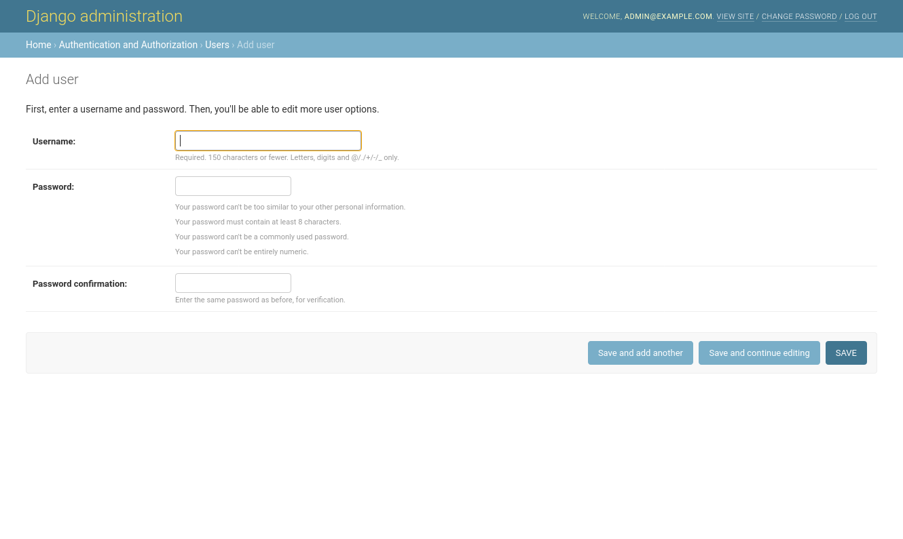
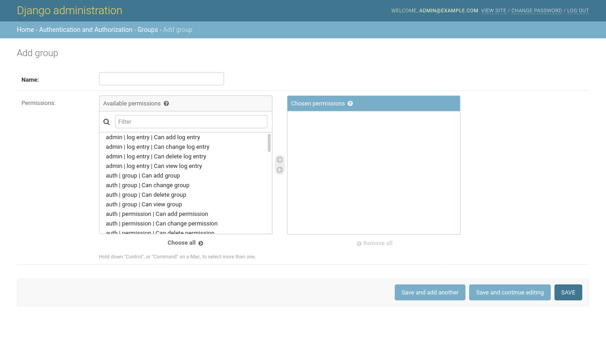

User management
===============

mPACT users are managed with the admin interface.

Choose "Users" under "Authentication and Authorization". You will see a
list of users, and at first, it will include only your user.

To add a new user, click "Add user". You will be prompted for their
username and password:

Click "Save", and then proceed to enter optional data about the user.

User permissions
----------------

New users are marked "Active" by default. Users who are not active will
not be allowed to log in, but their accounts remain in the database, and
can be marked active again in the future.

Users with "staff status" are allowed to log into the admin interface.
You can set what data they can see, and what data they can modify using
the "user permissions" field below.

Users with "superuser" status can log into the admin interface and have
all user permissions.

User groups
-----------

If you have different kinds of staff users, user groups make it easier
to assign different sets of permissions to them.

Again under "Authentication and Authorization", choose "Groups".

Click "Add group" to create a new group. You can give it a name, and
assign permissions to it:

Now you can edit users and assign them to groups in order to grant them
those groups' permissions.
